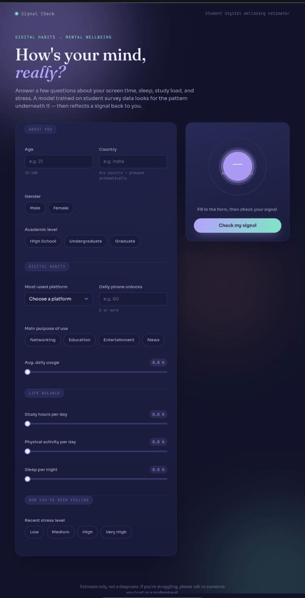
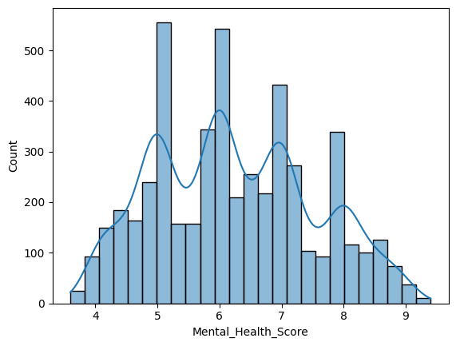
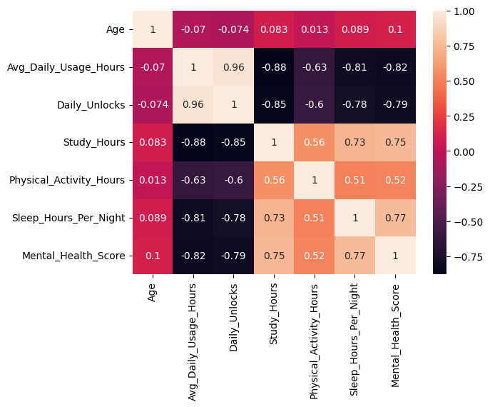
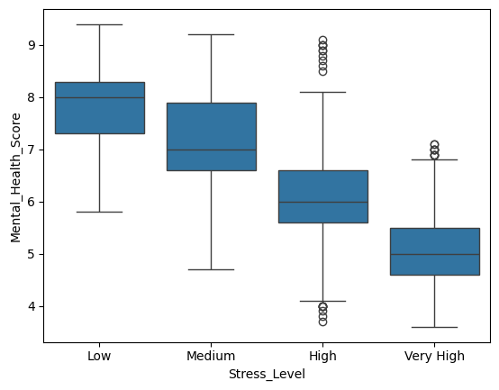

# 🧠 Signal Check — Digital Wellbeing Estimator

Predicting a student's mental health score from social media usage, sleep, study habits, and stress level — using a scikit-learn regression model served through a FastAPI backend, with a lightweight web frontend for live predictions.


<p align="center">
  
  
</p>

## 🔗 Live Demo

**[mental-health-score-1-9j70.onrender.com](https://mental-health-score-1-9j70.onrender.com/)**

> Hosted on Render's free tier — the first request after inactivity may take 30–60s to spin up.

## 📌 Overview

This project explores the relationship between students' social media habits and their mental wellbeing. Using a dataset of student survey responses (age, platform used, daily usage hours, sleep, study hours, physical activity, and stress level), it trains a regression model to predict a **mental health score**, then exposes that model as a REST API and a simple web UI so anyone can enter their own habits and get a prediction.

**Why it matters:** understanding how lifestyle factors correlate with mental health can help students, parents, and educators recognize early warning signs and make informed changes to daily habits.

## ✨ Features

- **End-to-end ML pipeline** — data cleaning, feature engineering, and model training in a reproducible notebook
- **REST API** built with FastAPI, with request validation via Pydantic (e.g. age bounds, allowed platforms, stress level categories)
- **Interactive web frontend** (HTML/CSS/JS) that calls the API and displays predictions in real time
- **CORS-enabled** backend so the frontend can be hosted separately from the API
- **Serialized model** (`joblib`) for fast inference without retraining

## 🛠️ Tech Stack

| Layer | Technology |
|---|---|
| Modeling | Python, pandas, scikit-learn, Jupyter Notebook |
| Backend / API | FastAPI, Pydantic, Uvicorn |
| Frontend | HTML, CSS, JavaScript |
| Model persistence | joblib |

## 📊 Dataset

`Student Social Media And Mental Health Impact.csv` — **5,000 student survey responses, 13 columns**, no missing values and no duplicate rows.

- Demographics: `Age`, `Gender`, `Country`, `Academic_Level`
- Social media behavior: `Most_Used_Platform`, `Purpose_Of_Use`, `Avg_Daily_Usage_Hours`, `Daily_Unlocks`
- Lifestyle: `Study_Hours`, `Physical_Activity_Hours`, `Sleep_Hours_Per_Night`
- Wellbeing: `Stress_Level`, target `Mental_Health_Score` (range 3.6–9.4, mean 6.23)

> Add source/attribution here if the CSV came from Kaggle or another public dataset — worth crediting for credibility.

### Score distribution



### What correlates with mental health score?



The strongest relationships in the data: **sleep hours** (+0.77) and **study hours** (+0.75) correlate positively with the score, while **daily usage hours** (−0.82) and **daily unlocks** (−0.79) correlate negatively — more screen time and phone-checking tracks with a lower wellbeing score.

### Stress level vs. score



A clear step down in score as self-reported stress increases from Low → Very High.

## 🧪 Model & Results

Three regression approaches were compared on a 70/30 train-test split (`random_state=42`):

| Model | Test R² | Train R² | MAE | RMSE |
|---|---|---|---|---|
| Linear Regression | 0.740 | 0.724 | 0.536 | 0.676 |
| **Random Forest** ✅ *(deployed model)* | **0.878** | 0.981 | **0.347** | **0.464** |
| Random Forest (hyperparameter-tuned via `RandomizedSearchCV`) | 0.865 | 0.955 | 0.369 | 0.487 |

**Final model:** the base `RandomForestRegressor` — it generalized slightly better on the held-out test set than the tuned version, so it's the one serialized to `Mental_Health_Model.pkl` and served by the API. (Interesting result: broader hyperparameter search on CV folds didn't beat the default estimator on this particular test split — a good reminder that tuning is a search, not a guarantee.)

**Preprocessing pipeline:**
- Log-transform + scale the right-skewed `Study_Hours`
- Standard-scale other numeric features (`Age`, `Avg_Daily_Usage_Hours`, `Daily_Unlocks`, `Physical_Activity_Hours`, `Sleep_Hours_Per_Night`)
- Ordinal-encode `Stress_Level` (Low → Very High)
- One-hot encode categorical features (`Gender`, `Academic_Level`, `Most_Used_Platform`, `Purpose_Of_Use`, and `Country` grouped into top-10 + "Other")

See [`ML_Project.ipynb`](./ML_Project.ipynb) for the full data exploration, feature engineering, and model comparison.

## 📁 Project Structure

```
Mental-Health-Score/
├── ML_Project.ipynb                                  # Data exploration, feature engineering, model training
├── Mental_Health_Model.pkl                            # Serialized trained model
├── Student Social Media And Mental Health Impact.csv   # Dataset
├── main.py                                             # FastAPI backend (prediction API)
├── index.html                                          # Frontend UI
├── script.js                                           # Frontend logic (calls the API)
├── style.css                                           # Frontend styling
├── requirements.txt                                    # Python dependencies
├── assets/                                             # README images (charts, screenshots)
└── README.md
```

## 🚀 Getting Started

### Prerequisites

- Python 3.10+
- pip

### Installation

```bash
git clone https://github.com/sahilkadam28/Mental-Health-Score.git
cd Mental-Health-Score
pip install -r requirements.txt
```

### Run the API

```bash
uvicorn main:app --reload
```

The API will be available at `http://127.0.0.1:8000`, with interactive docs at `http://127.0.0.1:8000/docs`.

### Run the frontend

Open `index.html` in your browser (or serve it with a simple local server), and make sure `script.js` points to your running API URL.

## 📡 API Reference

### `GET /`
Health check.

```json
{ "Welcome": "Mental Health Prediction API" }
```

### `POST /predict`

**Request body:**

```json
{
  "Age": 21,
  "Gender": "Male",
  "Country": "India",
  "Academic_Level": "Undergraduate",
  "Most_Used_Platform": "Instagram",
  "Purpose_Of_Use": "Entertainment",
  "Avg_Daily_Usage_Hours": 4.5,
  "Daily_Unlocks": 60,
  "Study_Hours": 3,
  "Physical_Activity_Hours": 1,
  "Sleep_Hours_Per_Night": 6.5,
  "Stress_Level": "High"
}
```

**Response:**

```json
{
  "predicted_mental_health_score": 5.42
}
```

## 🗺️ Roadmap / Future Improvements

- [ ] Add automated tests for the API and input validation
- [ ] Add a Dockerfile for one-command setup
- [ ] Try a wider hyperparameter search (grid search / more iterations) to see if it can beat the base Random Forest's 0.878 test R²
- [ ] Try gradient boosting models (XGBoost/LightGBM) for comparison
- [ ] Add model explainability (e.g. SHAP) to show which factors most affect a given prediction

## ⚠️ Disclaimer

This project is for educational purposes only. Predictions are based on a limited survey dataset and are **not** a substitute for professional mental health assessment or advice.

## 👤 Author

**Sahil Kadam**
[GitHub](https://github.com/sahilkadam28)
